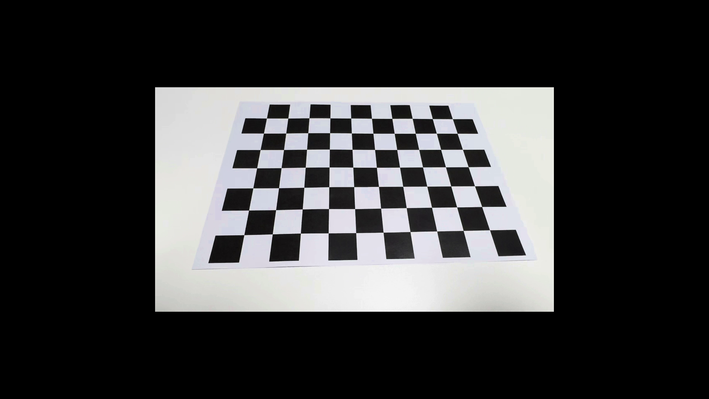
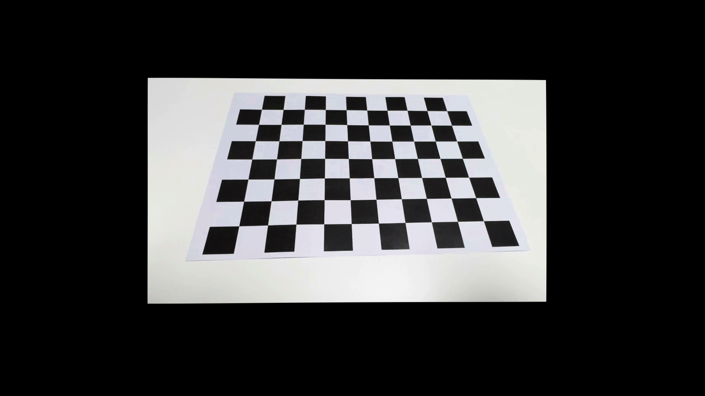

# CCDC — Camera Calibration & Distortion Correction

A simple tool for camera calibration and lens distortion correction using OpenCV and a chessboard pattern.

---

## Features

- **Camera Calibration** — Estimate intrinsic parameters (K) and distortion coefficients from a chessboard video
- **Distortion Correction** — Rectify lens distortion using calibration results

---

## Requirements

```
python >= 3.8
opencv-python
numpy
```

Install dependencies:
```bash
pip install opencv-python numpy
```

---

## Usage

### 1. Camera Calibration

```bash
python camera_calibration.py
```

- **Space**: Pause and preview detected corners
- **Enter**: Select the current frame
- **ESC**: Finish selection and run calibration

> Recommended: Select at least 20 frames from various angles for accurate results.

### 2. Distortion Correction

After calibration, paste the output `K` and `dist_coeff` values into `distortion_correction.py`, then:

```bash
python distortion_correction.py
```

- **Tab**: Toggle between Original / Rectified view
- **C**: Save both original and rectified images to `data/`
- **Space**: Pause
- **ESC**: Exit

---

## Calibration Results

**Camera**: iPhone 15 Plus (Action Mode)  
**Chessboard**: 10×7 inner corners, cell size = 25mm  
**Number of selected images**: 20+  
**RMS error**: 0.8143

### Camera Matrix (K)

```
[[685.09216986,   0.          , 966.21132282],
 [  0.         , 690.91696396, 559.47592990],
 [  0.         ,   0.         ,   1.        ]]
```

| Parameter | Value |
|-----------|-------|
| fx | 685.09 px |
| fy | 690.92 px |
| cx | 966.21 px |
| cy | 559.48 px |

### Distortion Coefficients

| k1 | k2 | p1 | p2 | k3 |
|----|----|----|----|----|
| -0.00966 | -0.00626 | -0.00048 | 0.00610 | 0.01462 |

> Note: Distortion coefficients are small because iPhone applies internal lens correction before saving video. The calibration itself is valid (RMS < 1.0).

---

## Demo

### Distortion Correction (Original vs Rectified)

| Original | Rectified |
|----------|-----------|
|  |  |

---

## File Structure

```
CCDC/
├── camera_calibration.py     # Calibration script
├── distortion_correction.py  # Distortion correction script
├── data/
│   ├── original.png          # Screenshot before correction (saved by pressing C)
│   └── rectified.png         # Screenshot after correction (saved by pressing C)
└── README.md
```