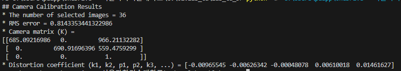
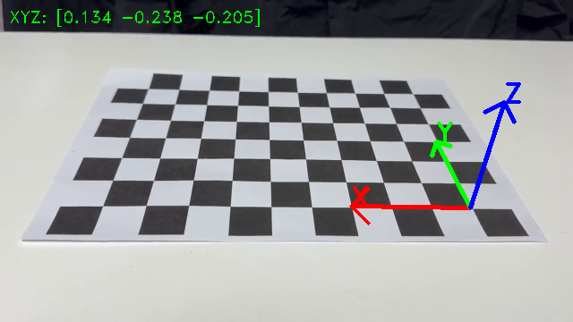

# CCDC — Camera Calibration, Distortion Correction (& AR)

A simple tool for camera calibration, lens distortion correction, and 3D axis AR visualization using OpenCV and a chessboard pattern.

---

## Features

- **Camera Calibration** — Estimate intrinsic parameters (K) and distortion coefficients from a chessboard video
- **Distortion Correction** — Rectify lens distortion using calibration results
- **3D Axis AR** — Estimate camera pose via PnP and overlay X/Y/Z axes on the chessboard in real time

---

## Requirements

```
python >= 3.8
opencv-python
numpy
```

Install dependencies:
```bash
pip install opencv-python numpy
```

---

## Usage

### 1. Camera Calibration

```bash
python camera_calibration.py
```

- **Space**: Pause and preview detected corners
- **Enter**: Select the current frame
- **ESC**: Finish selection and run calibration

> Recommended: Select at least 20 frames from various angles for accurate results.

### 2. Distortion Correction

After calibration, paste the output `K` and `dist_coeff` values into `distortion_correction.py`, then:

```bash
python distortion_correction.py
```

- **Tab**: Toggle between Original / Rectified view
- **C**: Save both original and rectified images to `data/`
- **Space**: Pause
- **ESC**: Exit

### 3. Pose Estimation & 3D Axis AR

After calibration, paste the output `K` and `dist_coeff` values into `pose_estimation_ar.py`, then:

```bash
python pose_estimation_ar.py
```

- **C**: Save AR screenshot to `data/ar_result.png`
- **Space**: Pause
- **ESC**: Exit

> The script detects the chessboard in each frame, estimates the camera pose using `cv.solvePnP()`, and draws color-coded 3D axes (X: red, Y: green, Z: blue) with text labels on the board.

---

## Calibration Results

**Camera**: iPhone 15 Plus (Normal Mode, 1× lens)
**Chessboard**: 10×7 inner corners, cell size = 25mm
**Number of selected images**: 43
**RMS error**: 0.5664



### Camera Matrix (K)

```
[[1.10906511e+03, 0.            , 6.35873599e+02],
 [0.            , 1.10914402e+03, 3.63121374e+02],
 [0.            , 0.            , 1.            ]]
```

| Parameter | Value |
|-----------|-------|
| fx | 1109.07 px |
| fy | 1109.14 px |
| cx | 635.87 px |
| cy | 363.12 px |

### Distortion Coefficients

| k1 | k2 | p1 | p2 | k3 |
|----|----|----|----|----|
| 0.22140 | -0.73615 | 0.00219 | -0.00156 | 0.53865 |

> Note: Sub-pixel corner refinement (`cv.cornerSubPix`) was applied to improve calibration accuracy.

---

## Demo

### Distortion Correction (Original vs Rectified)

| Original | Rectified |
|----------|-----------|
|  |  |

### Pose Estimation & 3D Axis AR



---

## File Structure

```
CCDC/
├── camera_calibration.py     # Calibration script
├── distortion_correction.py  # Distortion correction script
├── pose_estimation_ar.py     # Pose estimation & 3D axis AR script
├── data/
│   ├── original.png          # Screenshot before distortion correction (press C)
│   ├── rectified.png         # Screenshot after distortion correction (press C)
│   └── ar_result.png         # AR result screenshot (press C)
└── README.md
```